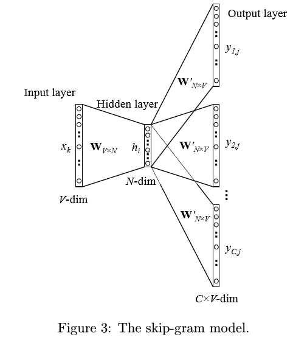

# SGNS-PyTorch
SkipGram NegativeSampling implemented in PyTorch.

## Paper
1. [Efficient Estimation of Word Representations in Vector Space](http://arxiv.org/pdf/1301.3781.pdf) (original word2vec paper)
2. [Distributed Representations of Words and Phrases and their Compositionality](http://papers.nips.cc/paper/5021-distributed-representations-of-words-and-phrases-and-their-compositionality.pdf) (negative sampling paper)

## Notes

Skip-gram是在给定目标单词的情况下，预测其上下文单词。

用两个word matrix，W表示目标单词向量矩阵(V\*N)，W'表示上下文单词向量矩阵（N\*V），词向量维度N，词汇表维度V。

计算步骤：
1. 投影：$h_i=Wx_k$
2. 计算相似度：$z=W'h_i$
3. 转换为概率分布：$\hat y=\text{softmax}(z)$

## Reference
- https://github.com/theeluwin/pytorch-sgns
- https://github.com/fanglanting/skip-gram-pytorch
- https://github.com/Andras7/word2vec-pytorch
- https://www.kaggle.com/karthur10/skip-gram-implementation-with-pytorch-step-by-step

